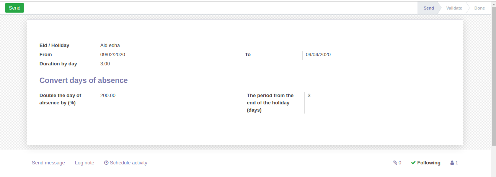
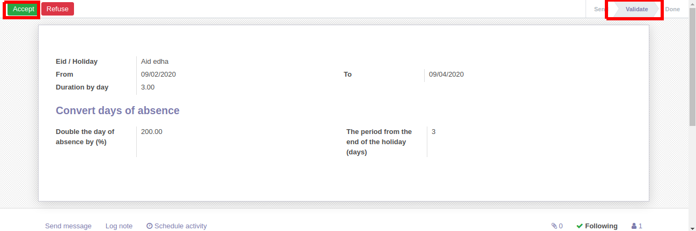

# Public Holidays

Using this module you can manage official public holidays / Aids

**Table of contents**

- [Overview](#overview)
  - [Adding public holiday](#adding-infraction-types)
  - [Validate public holiday](#validate-public-holiday)
- [Configuration](#configuration)
- [Bug Tracker](#bug-tracker)
- [Maintainer](#maintainer)

## Overview

#### Adding public holiday

To create public holidays go to: Public holiday -> Official Public holiday.

#### Validate public holiday

Click at Accept to validate the public holiday:

## Configuration

- Go to setting -> users & companies -> Select the target user.
- In the access rights, check "Manage Stages" (If needed).
- Go to public holidays -> configuration -> public holidays stages.
- Select "Assign Type".

## Bug Tracker

Bugs are tracked on [Gitlab Issues](https://gitlab.com/hadooc/odoo-sa/hr/issues)

In case of trouble, please check there if your issue has already been reported. If you spotted it first, help us smash
it by providing detailed and welcomed feedback.

## Maintainer

This module is maintained by Hadooc.

To contribute to this module, please visit [Contributing Page](https://gitlab.com/hadooc/extra/wikis/Contributing).
