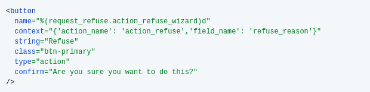

# Request Refuse

This module is used to add "refusal reason" while refusing a request.

**Table of contents**

- [Overview](#overview)
- [Configuration](#configuration)
- [Bug Tracker](#bug-tracker)
- [Maintainer](#maintainer)

## Overview

This module is used to add "refusal reason" while refusing a request.

Here is how you can implement this module:

You need to add a string field to your model.

Here is an example:

`refuse_reason = fields.Char(string="Refusal reason")`

Add the Refuse button:

And then add this field to you view if needed.

Here is an example:

`<field name="refuse_reason" attrs="{'invisible' : [('state', '!=', 'refuse')]}"/>`

## Configuration

You don't need a specific configuration.

## Bug Tracker

Bugs are tracked on [Gitlab Issues](https://gitlab.com/hadooc/odoo/base/issues).

In case of trouble, please check there if your issue has already been reported. If you
spotted it first, help us smash it by providing detailed and welcomed feedback.

## Maintainer

This module is maintained by Hadooc.

To contribute to this module, please visit
[Contributing Page](https://gitlab.com/hadooc/extra/wikis/Contributing).
