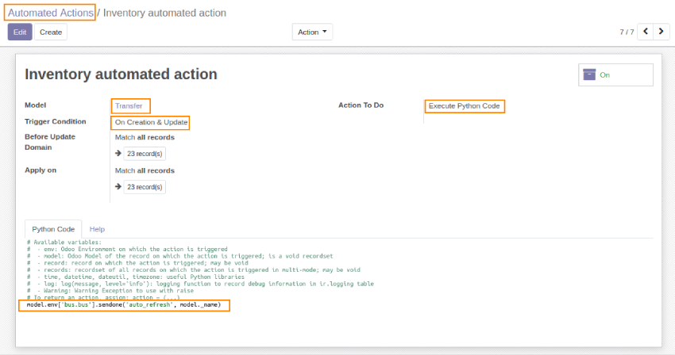

# Web Auto Refresh

This module is a fork of web_auto_refresh developped by Fisher Yu on Odoo v10. This fork
works with all non-edited views, not only with kanban and list views.

**Table of contents**

- [Overview](#overview)
  - [Change Colors](#change-colors)
- [Configuration](#configuration)
- [Usage](#usage)
- [Bug Tracker](#bug-tracker)
- [Maintainer](#maintainer)

## Overview

This module is a fork of web_auto_refresh developped by Fisher Yu on Odoo v10. This fork
works with all non-edited views, not only with kanban and list views.

## Configuration

To configure this module, you need to:

1. Go to `Setting > Technical > Actions > Window Actions`, find the desired action.

2. Add one automated action for the target model, in the linked automated action add the
   following python code:

   `model.env['bus.bus'].sendone('auto_refresh', model._name).`

   This automated action can be applied (when to run) to creation, update or delete per
   your requirement.

3. It is also possible to force the opening of a page by indicating #action.

   For example: an automatic return to the home page is done by executing the code:

   `model.env ['bus.bus'].sendone ('auto_refresh', '#home')`

## Usage

(We will take stock.picking as an example model)

1. Add the automated action for the target model from
   `Settings > Technical > automation > Automated Actions` menu :
   

2. Go to any view of the selected model, in display mode.

3. In another session (login via another browser and other computer), create, change or
   delete records of the model, then save.

4. The original view in display mode will be auto refreshed.

## Bug Tracker

Bugs are tracked on [Gitlab Issues](https://gitlab.hadooc.com/odoo/web/issues)

In case of trouble, please check there if your issue has already been reported. If you
spotted it first, help us smash it by providing detailed and welcomed feedback.

## Maintainer

This module is maintained by Hadooc.

To contribute to this module, please visit
[Contributing Page](https://gitlab.com/hadooc/extra/wikis/Contributing).
